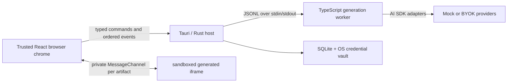

# VibeSurfer

VibeSurfer is a generative browser: type an HTTP(S) address and it imagines the page that could exist there instead of fetching that origin. The result is a validated HTML artifact with its own title, favicon, links, navigation history, and persistent site context. Following a generated link asks the model for the next page in the same imagined world.

The repository contains both a fast browser preview and the Tauri 2 desktop runtime. They share the browser UI, but only the desktop runtime owns provider credentials, durable artifacts, and the generation sidecar.

> **Important:** entering `https://example.com/path` is a generation request. VibeSurfer does not contact `example.com`. Opening a real website is a separate, explicit action in the system browser.

## What works today

- Generated navigation from the address bar, links, forms, middle-click, modifier-click, and `target="_blank"`.
- Back and forward restore committed artifacts without spending model tokens; regenerate creates a new artifact version.
- Per-tab generated title and favicon metadata, navigation history, a local workspace profile, horizontal or vertical tabs, and theme packs.
- Deterministic, network-free mock generation for development and CI.
- BYOK connections for OpenAI, Anthropic, Google, and HTTPS OpenAI-compatible endpoints in the desktop app.
- Quick and Deep generation pipelines with ordered progress, cancellation, deterministic validation, and bounded repair.
- Editable page-generation instructions layered below immutable protocol and security instructions.
- Optional Tailwind artifact compilation and configurable semantic image resolution.
- Sandboxed generated documents connected to the trusted browser chrome through a private, typed message bridge.
- SQLite artifact/site-world persistence and operating-system credential-vault storage in the Tauri runtime.

## Browser preview and desktop app

| Capability | Browser preview | Tauri desktop |
| --- | --- | --- |
| Start command | `npm run dev` | `npm run tauri dev` |
| Generation | Deterministic in-process mock | Supervised JSONL generation worker |
| Provider keys | Unavailable | OS credential vault, scoped by profile |
| Artifacts | Browser session state | SQLite-backed durable artifacts and site worlds |
| Best for | UI, navigation, themes, deterministic demos | BYOK generation, persistence, worker lifecycle, packaging |

The preview at `http://127.0.0.1:1420` intentionally makes no paid provider calls. Selecting a cloud model there does not silently substitute a real connection; use the desktop app to add and verify a provider.

## Architecture



The React application owns interaction and lightweight session state. In desktop mode, Rust owns profiles, secrets, persistence, cancellation, and worker supervision. The isolated TypeScript worker owns provider adapters, prompt assembly, generation pipelines, HTML compilation, image resolution, and validation.

The worker protocol is newline-delimited JSON. Each request has a `requestId`; generation also has a `jobId`. Events are ordered and normalized (`generation.started`, phase/metadata/validation/warning events, then exactly one completed, failed, or cancelled terminal event). See [the worker protocol](generation-worker/README.md) for the exact contract.

## Generation modes

### Quick

Quick makes one schema-constrained model request, compiles the returned document, validates it, and commits one artifact. It is the lower-latency and lower-token option.

### Deep

Deep uses separate site-architecture, page-plan, and page-build requests. It then performs deterministic validation and may make at most one repair request when validation fails and the request budget permits it. Bounded navigation history and the current site world are included so related pages remain coherent.

Both modes build prompts in distinct layers:

1. immutable protocol and security rules;
2. the editable user instruction;
3. mode-specific guidance;
4. bounded page, site-world, and navigation context.

Changing the editable instruction cannot remove the artifact safety rules.

## Providers and credentials

The generation worker supports these provider kinds:

- `mock` — deterministic, local, and credential-free;
- `openai`;
- `anthropic`;
- `google`;
- `openai-compatible` — requires an HTTPS base URL;
- `codex` — a routing boundary only; see below.

Add BYOK connections under **Settings → Models & credentials** in the desktop app. A raw key crosses the React-to-Rust boundary once, is stored by the platform credential service, and never enters Zustand, local storage, artifact HTML, a command-line argument, or a protocol log. Rust retrieves it for the selected profile and passes it only in the in-memory stdin message for the worker request.

If a normal API provider has no credential, generation fails with `provider-not-configured`; the desktop runtime does not pretend that the mock provider was the requested cloud model.

### Codex App Server boundary

The existing Codex sign-in bridge can report account status and start the official `codex login` flow. It does **not** route page generation through a Codex account yet. `codex` is deliberately not treated as an OpenAI API key provider: the worker returns `provider-route-required`, and the Rust host must eventually send that job through a dedicated Codex App Server adapter. Use mock or a BYOK provider for generation in this build.

## Page compilation

Model output is never inserted into the page surface verbatim. Before commit, the worker parses and transforms the full document, removes active or remote content, normalizes virtual navigation, compiles styles, resolves image intents, and validates the result.

Tailwind applies only to generated artifacts; the browser chrome uses its own semantic CSS token system. When Tailwind is enabled, the pinned compiler produces static CSS without a CDN. A compilation failure falls back to a safe deterministic stylesheet and emits a warning. Tailwind can be disabled in generation settings.

Image handling is also configurable:

- **Off** replaces image intents with neutral local placeholders;
- **Local library** resolves deterministic local placeholders;
- **Keyword placeholder** uses semantic tags and falls back locally unless trusted external image requests are explicitly enabled.

Provider credentials and generated-frame code never participate in image fetching. External image access is off by default and belongs to the trusted compiler boundary, not the iframe.

## Sandbox and security boundary

Generated pages render inside a local, self-contained `artifact-frame.html` shell with `sandbox="allow-scripts"`. They receive no same-origin, popup, download, top-navigation, or privileged form capability. The shell's only executable is a classic host runtime authorized by its exact SHA-256 hash in both CSP layers; it has no script subresources or network permission. Every runtime instance announces a random instance ID, base64url nonce, and artifact identity before receiving a fresh `MessageChannel`. The host then sends one bounded passive display payload over that private port, and the shell sanitizes it again before rendering. WebKit restarts replace only the stale private channel, and subsequent communication is schema-checked on the active port.

The compiler removes or rejects, among other things:

- all generated scripts, inline event handlers, frames, embeds, objects, and meta refreshes;
- external stylesheets, CSS imports/URLs, direct remote image sources, and `<base>` rewrites;
- `javascript:`, `file:`, and unsupported URL schemes; `data:` is allowed only for bounded, allowlisted passive media;
- unbounded documents, messages, and artifact payloads.

Generated code cannot invoke Tauri commands, access the filesystem or credential store, call a model provider, or navigate the top-level application. The full trust model and release gates are documented in [the generative runtime ADR](docs/architecture/generative-runtime.md).

## Prerequisites

- Node.js 22 or newer and npm.
- A stable Rust toolchain with Cargo.
- The platform dependencies required by Tauri 2. Follow the [official Tauri prerequisites](https://v2.tauri.app/start/prerequisites/).
- Bun 1.3.14 when building the self-contained generation sidecar for a desktop package. Bun is not required for the browser preview, tests, or the regular web build.

On Ubuntu/Debian, Tauri currently documents these native packages:

```bash
sudo apt-get update
sudo apt-get install -y \
  libwebkit2gtk-4.1-dev \
  build-essential \
  curl \
  wget \
  file \
  libxdo-dev \
  libssl-dev \
  libayatana-appindicator3-dev \
  librsvg2-dev
```

## Install and run

Install from both lockfiles with one root command:

```bash
npm ci
```

The root `postinstall` runs `npm ci --prefix generation-worker --ignore-scripts`, so a second manual install in `generation-worker/` is unnecessary.

Run the deterministic browser preview:

```bash
npm run dev
```

Run the full desktop development runtime:

```bash
npm run tauri dev
```

The Rust host discovers `generation-worker/dist/index.js` through Node. If the compiled worker is absent and Bun is available, development discovery can use `generation-worker/src/index.ts` instead.

## Verify and build

The complete local gate is:

```bash
npm run verify
```

It runs the root TypeScript check and tests, the generation-worker check/tests/build, and the Rust test suite. No live provider key or paid request is required.

Useful focused commands:

```bash
npm test                       # root and integration tests
npm run typecheck              # root TypeScript only
npm run worker:verify          # worker check, tests, and build
npm run worker:smoke           # compiled JSONL worker, mock generation, zero-origin-fetch assertion
cargo test --locked --manifest-path src-tauri/Cargo.toml
cargo check --locked --manifest-path src-tauri/Cargo.toml
```

Build the frontend and compiled Node worker:

```bash
npm run build
npm run preview
```

Build a self-contained worker sidecar for the current platform, then smoke-test it:

```bash
npm run worker:sidecar
npm run worker:sidecar:smoke
```

To build the self-contained sidecar, smoke-test it, and produce the platform desktop bundle:

```bash
npm run desktop:build
```

`npm run build:desktop` is an alias for the same complete package command. It runs Tauri with `src-tauri/tauri.bundle.conf.json`; Tauri also invokes the normal frontend build. Build and smoke-test release sidecars on a runner matching each target platform. Cross-target sidecar arguments are documented in [generation-worker/README.md](generation-worker/README.md#packaged-tauri-sidecar).

Source-built macOS bundles use an ad-hoc signature so they launch correctly on Apple Silicon. Public distribution still requires a Developer ID signature and Apple notarization; those credentials are intentionally not part of this repository.

## Project map

```text
src/                         React browser chrome, session state, iframe host
src/generation/              frontend generation coordinator and preview mock
src-tauri/                   Rust host, SQLite, credential vault, worker manager
generation-worker/           AI SDK adapters, pipelines, compiler, JSONL runtime
scripts/smoke-worker.mjs     dist/sidecar protocol and zero-origin-fetch smoke test
tests/                       browser, navigation, bridge, and runtime tests
docs/architecture/           accepted runtime and browser-surface decisions
```

## Current limitations

- Legacy real-web tabs are deliberately network-inert. A live site opens only through an explicit command in the external system browser; entering its address in VibeSurfer still generates an imagined artifact.
- Codex account-backed generation still needs the host-owned Codex App Server adapter described above.
- `generation.preview` exists in the worker event vocabulary but progressive fragment rendering is reserved for future work; completed artifacts are the stable contract.
- Release sidecars are target-specific. A distributable desktop application should be built and smoke-tested on each target operating system.

## CI

[`.github/workflows/ci.yml`](.github/workflows/ci.yml) reproduces the lockfile install, complete root verification, production frontend/worker build, and locked Rust test/check on Ubuntu. It relies on the root `postinstall` for the nested generation-worker install and uses only the deterministic mock provider.
