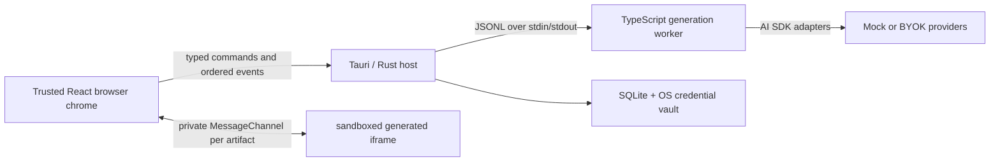

# vibesurfer

vibesurfer is a generative browser: type an HTTP(S) address and it imagines the page that could exist there instead of fetching that origin. The result is a validated HTML artifact with its own title, favicon, links, navigation history, and persistent site context. Following a generated link asks the model for the next page in the same imagined world.

The repository contains both a fast browser preview and the Tauri 2 desktop runtime. They share the browser UI, but only the desktop runtime owns provider credentials, durable artifacts, and the generation sidecar.

> **Important:** entering `https://example.com/path` is a generation request. vibesurfer does not contact `example.com`. Opening a real website is a separate, explicit action in the system browser.

## What works today

- Generated navigation from the address bar, links, forms, middle-click, modifier-click, and `target="_blank"`.
- Desktop registration for `vibe://` and `vibes://`; each invocation opens one fresh blank tab and ignores the URL payload.
- Back and forward restore committed artifacts without spending model tokens; regenerate preserves the current site identity, while Reimagine creates a new incarnation transactionally.
- Profile-scoped workspaces with independent tabs, chrome skin, world prompt revision, model controls, generation settings, history, artifacts, provider connections, and site worlds.
- Deterministic, network-free mock generation for development and CI.
- BYOK connections for OpenAI, Anthropic, Google, and HTTPS OpenAI-compatible endpoints in the desktop app.
- Switchable Full and Turbo generation: Full uses the exact two-request Director → Builder pipeline; Turbo uses one bounded plain-HTML request. Both retain ordered progress, cancellation, and deterministic validation with no semantic repair request.
- Editable profile world prompts snapshotted into new site identities below immutable protocol and security instructions.
- Optional Tailwind artifact compilation, generated JavaScript interactions, and configurable semantic image resolution.
- Sandboxed generated documents connected to the trusted browser chrome through a private, typed message bridge.
- SQLite artifact/site-world persistence and operating-system credential-vault storage in the Tauri runtime.

## Browser preview and desktop app

| Capability | Browser preview | Tauri desktop |
| --- | --- | --- |
| Start command | `npm run dev` | `npm run tauri dev` |
| Generation | Deterministic in-process mock | Supervised JSONL generation worker |
| Provider keys | Unavailable | OS credential vault, scoped by profile |
| Artifacts | Browser session state | SQLite-backed durable artifacts and site worlds |
| Best for | UI, navigation, themes, deterministic demos | BYOK generation, persistence, worker lifecycle, packaging |

The preview at `http://127.0.0.1:1420` intentionally makes no paid provider calls. Selecting a cloud model there does not silently substitute a real connection; use the desktop app to add and verify a provider.

## Architecture



The React application owns interaction and lightweight session state. In desktop mode, Rust owns profiles, secrets, persistence, cancellation, and worker supervision. The isolated TypeScript worker owns provider adapters, prompt assembly, generation pipelines, HTML compilation, image resolution, and validation.

The worker protocol is newline-delimited JSON. Each request has a `requestId`; generation also has a `jobId`. Events are ordered and normalized (`generation.started`, phase/metadata/validation/warning events, then exactly one completed, failed, or cancelled terminal event). See [the worker protocol](generation-worker/README.md) for the exact contract.

## Generation pipeline

Full mode uses exactly two schema-constrained model requests with the same selected model, reasoning effort, and service tier:

1. **Page Director** receives the URL/navigation context, the profile world-prompt snapshot, any frozen SiteWorld identity and history, plus the complete versioned capability catalog. It returns a strict identity/direction contract with free-form creative rationale and implementation notes.
2. **Page Builder** receives the immutable security/output protocol, URL, world-prompt snapshot, approved brief, and only the capability contracts selected by Director. It cannot replace the approved identity, palette, fonts, or favicon.

Turbo mode skips Director and structured output. It sends one short, bounded prompt and receives only HTML with a 4,096-token ceiling; metadata, favicon, missing document structure and routes are completed deterministically by the host.

The resulting HTML is sanitized, compiled, image-resolved, and validated deterministically. A failure does not trigger another model request and does not replace the previously committed artifact. Cached URLs, history restores, and same-document fragments make no model calls.

Site identity is keyed by profile and origin. Same-origin navigation and new tabs reuse the active SiteWorld incarnation; another profile can imagine the hostname differently. Reimagine commits a candidate before archiving the current incarnation, and archived artifacts remain static and restorable.

## Providers and credentials

The generation worker supports these provider kinds:

- `mock` — deterministic, local, and credential-free;
- `openai`;
- `anthropic`;
- `google`;
- `openai-compatible` — requires an HTTPS base URL;
- `codex` — reuses a compatible system ChatGPT/Codex session without exposing its credentials to the renderer.

Add BYOK connections under **Settings → Models & credentials** in the desktop app. A raw key crosses the React-to-Rust boundary once, is stored by the platform credential service, and never enters Zustand, local storage, artifact HTML, a command-line argument, or a protocol log. Rust retrieves it for the selected profile and passes it only in the in-memory stdin message for the worker request.

If a normal API provider has no credential, generation fails with `provider-not-configured`; the desktop runtime does not pretend that the mock provider was the requested cloud model.

### Codex system-session boundary

The Codex bridge reuses an authenticated system ChatGPT session, reports account status, loads the account's current model/effort/service-tier catalog through the official App Server protocol, and can start the official `codex login` flow. On macOS it probes a compatible CLI bundled with ChatGPT before falling back to `codex` on `PATH`, so an obsolete global CLI cannot hide a valid ChatGPT session. `VIBESURFER_CODEX_PATH` can explicitly name another CLI.

For generation, Rust revalidates the signed-in binary and canonicalizes the selected model, reasoning effort, and speed before giving the worker only the absolute executable path. No API key or auth payload crosses the renderer/worker protocol. Each structured stage runs through Codex App Server over stdio with an ephemeral read-only empty workspace, project context, network, apps, and shell tools disabled, a schema-constrained turn, and a sanitized environment. App Server text deltas drive the progressive HTML preview. A future second auth layer may add an app-owned device-code session; the current connection deliberately leaves the system ChatGPT account and its credentials under Codex/ChatGPT ownership.

## Page compilation

Model output is never inserted into the page surface verbatim. While output streams, the worker repeatedly parses and sanitizes the accumulated partial HTML and updates one sandboxed frame; scripts never run during this preview. Before commit, it transforms the full document, removes disallowed active or remote content, normalizes virtual navigation, compiles styles, resolves image intents, and validates the result.

Tailwind applies only to page artifacts; the browser chrome uses its own semantic CSS token system. When Tailwind is enabled, the pinned compiler exposes the complete stock Tailwind 4 theme, accepts safe arbitrary values, and emits static CSS only for the literal classes used by that page. It adds no application palette, font, container, card, radius, or other visual theme. A compilation failure falls back to a neutral reset and emits a warning. Tailwind can be disabled in generation settings.

One **Use LoremFlickr images** toggle controls image handling. It is enabled by default and resolves short, subject-specific keyword tags to ordinary remote image URLs through the fixed LoremFlickr/Flickr CDN allowlist. Each image gets its own cache-busting selection while remaining stable when a persisted artifact is reopened. Images load independently after the HTML, while every other remote image host and all CSS/script network access remain blocked. If the toggle is off, unresolved intents are omitted rather than replaced with an invented gradient or local fake image.

## Sandbox and security boundary

Generated pages render inside a local, self-contained `artifact-frame.html` shell with `sandbox="allow-scripts"`. They receive no same-origin, popup, download, top-navigation, or privileged form capability. The host runtime is authorized by its exact SHA-256 hash in both CSP layers; it has no script subresources or general network permission, while `img-src` is narrowly allowlisted for LoremFlickr. Generated JavaScript is off by default. If the user opts in, only sanitized inline classic scripts from the final artifact run through a dedicated CSP nonce after the body exists; external/module scripts, inline handlers, and all preview scripts remain blocked. Every runtime instance announces a random instance ID, base64url nonce, and artifact identity before receiving a fresh `MessageChannel`; that fragment identity is scrubbed before generated code can execute. The shell sanitizes each update again while preserving scroll, and WebKit restarts replace only the stale private channel.

The compiler removes or rejects, among other things:

- all generated scripts unless explicitly enabled, plus every external/module script, inline event handler, frame, embed, object, and meta refresh;
- external stylesheets, CSS imports/URLs, direct remote image sources, and `<base>` rewrites;
- `javascript:`, `file:`, and unsupported URL schemes; `data:` is allowed only for bounded, allowlisted passive media;
- unbounded documents, messages, and artifact payloads.

Generated code cannot invoke Tauri commands, access the filesystem or credential store, call a model provider, or navigate the top-level application. The full trust model and release gates are documented in [the generative runtime ADR](docs/architecture/generative-runtime.md).

## Prerequisites

- Node.js 22 or newer and npm.
- A stable Rust toolchain with Cargo.
- The platform dependencies required by Tauri 2. Follow the [official Tauri prerequisites](https://v2.tauri.app/start/prerequisites/).
- Bun 1.3.14 when building the self-contained generation sidecar for a desktop package. Bun is not required for the browser preview, tests, or the regular web build.

On Ubuntu/Debian, Tauri currently documents these native packages:

```bash
sudo apt-get update
sudo apt-get install -y \
  libwebkit2gtk-4.1-dev \
  build-essential \
  curl \
  wget \
  file \
  libxdo-dev \
  libssl-dev \
  libayatana-appindicator3-dev \
  librsvg2-dev
```

## Install and run

Install from both lockfiles with one root command:

```bash
npm ci
```

The root `postinstall` runs `npm ci --prefix generation-worker --ignore-scripts`, so a second manual install in `generation-worker/` is unnecessary.

Run the deterministic browser preview:

```bash
npm run dev
```

Run the full desktop development runtime:

```bash
npm run tauri dev
```

The Rust host discovers `generation-worker/dist/index.js` through Node. If the compiled worker is absent and Bun is available, development discovery can use `generation-worker/src/index.ts` instead.

## Verify and build

The complete local gate is:

```bash
npm run verify
```

It runs the root TypeScript check and tests, the generation-worker check/tests/build, and the Rust test suite. No live provider key or paid request is required.

Useful focused commands:

```bash
npm test                       # root and integration tests
npm run typecheck              # root TypeScript only
npm run worker:verify          # worker check, tests, and build
npm run worker:smoke           # compiled JSONL worker, mock generation, zero-origin-fetch assertion
cargo test --locked --manifest-path src-tauri/Cargo.toml
cargo check --locked --manifest-path src-tauri/Cargo.toml
```

Build the frontend and compiled Node worker:

```bash
npm run build
npm run preview
```

Build a self-contained worker sidecar for the current platform, then smoke-test it:

```bash
npm run worker:sidecar
npm run worker:sidecar:smoke
```

To build the self-contained sidecar, smoke-test it, and produce the platform desktop bundle:

```bash
npm run desktop:build
```

`npm run build:desktop` is an alias for the same complete package command. It runs Tauri with `src-tauri/tauri.bundle.conf.json`; Tauri also invokes the normal frontend build. Build and smoke-test release sidecars on a runner matching each target platform. Cross-target sidecar arguments are documented in [generation-worker/README.md](generation-worker/README.md#packaged-tauri-sidecar).

Source-built macOS bundles use an ad-hoc signature so they launch correctly on Apple Silicon. Public distribution still requires a Developer ID signature and Apple notarization; those credentials are intentionally not part of this repository.

## Project map

```text
src/                         React browser chrome, session state, iframe host
src/generation/              frontend generation coordinator and preview mock
src-tauri/                   Rust host, SQLite, credential vault, worker manager
generation-worker/           AI SDK adapters, pipelines, compiler, JSONL runtime
scripts/smoke-worker.mjs     dist/sidecar protocol and zero-origin-fetch smoke test
tests/                       browser, navigation, bridge, and runtime tests
docs/architecture/           accepted runtime and browser-surface decisions
```

## Current limitations

- Legacy real-web tabs are deliberately network-inert. A live site opens only through an explicit command in the external system browser; entering its address in vibesurfer still generates an imagined artifact.
- The current Codex route depends on a compatible authenticated system ChatGPT/Codex installation; app-owned device-code sign-in remains future work.
- Progressive previews are transient and sanitized; only the completed, validated artifact is persisted as the stable page contract.
- Release sidecars are target-specific. A distributable desktop application should be built and smoke-tested on each target operating system.

## CI

[`.github/workflows/ci.yml`](.github/workflows/ci.yml) reproduces the lockfile install, complete root verification, production frontend/worker build, and locked Rust test/check on Ubuntu. It relies on the root `postinstall` for the nested generation-worker install and uses only the deterministic mock provider.
